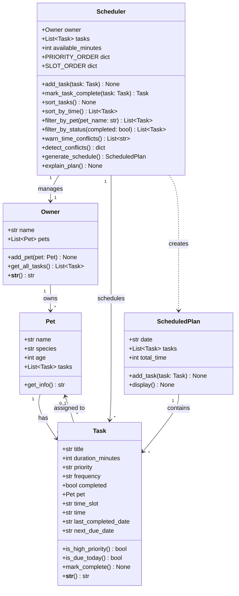

# PawPal+ — Final UML Class Diagram

## Key relationships vs. initial design

| Change | Reason |
|---|---|
| `Task` gained `pet`, `time_slot`, `time`, `frequency`, `last_completed_date`, `next_due_date` | Needed for recurrence logic, timeline ordering, and conflict detection |
| `Scheduler` gained `sort_by_time()`, `filter_by_pet()`, `filter_by_status()`, `warn_time_conflicts()`, `detect_conflicts()`, `mark_task_complete()` | Phase 3 algorithmic improvements |
| `Task` gained `is_due_today()` and `mark_complete()` | Recurrence logic required task-level awareness of its own schedule |
| `Scheduler` now holds `PRIORITY_ORDER` and `SLOT_ORDER` dicts | Centralised sort keys rather than inline magic numbers |
